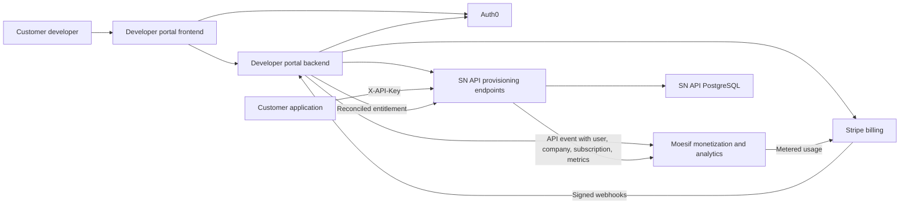
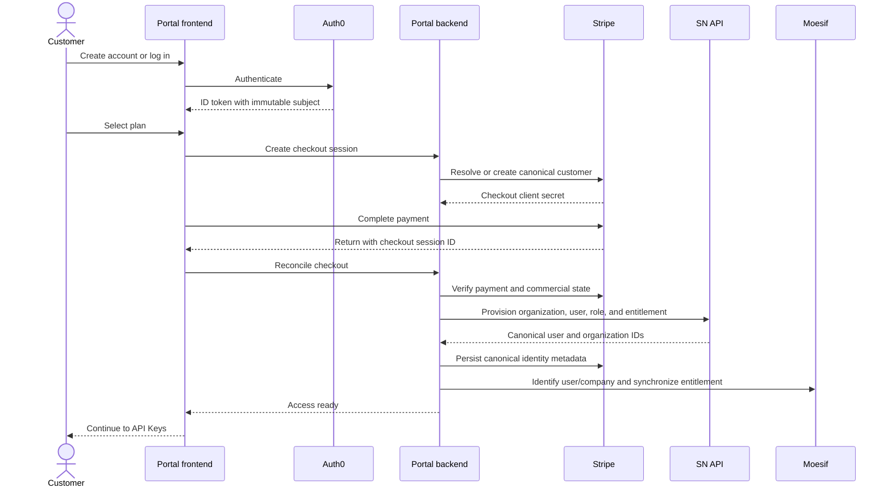
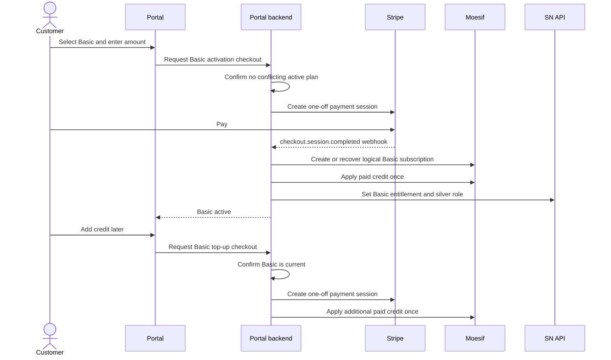
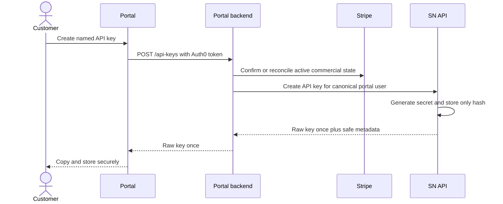
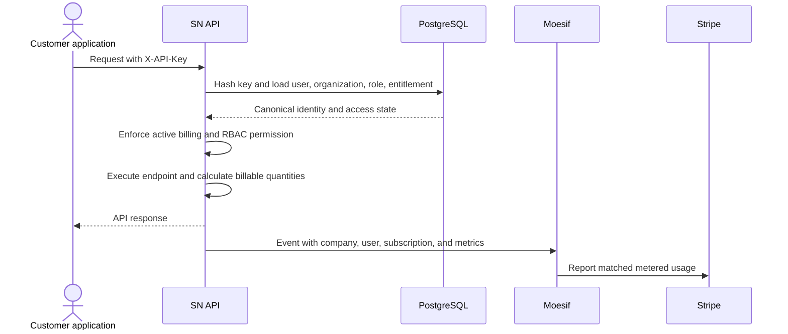
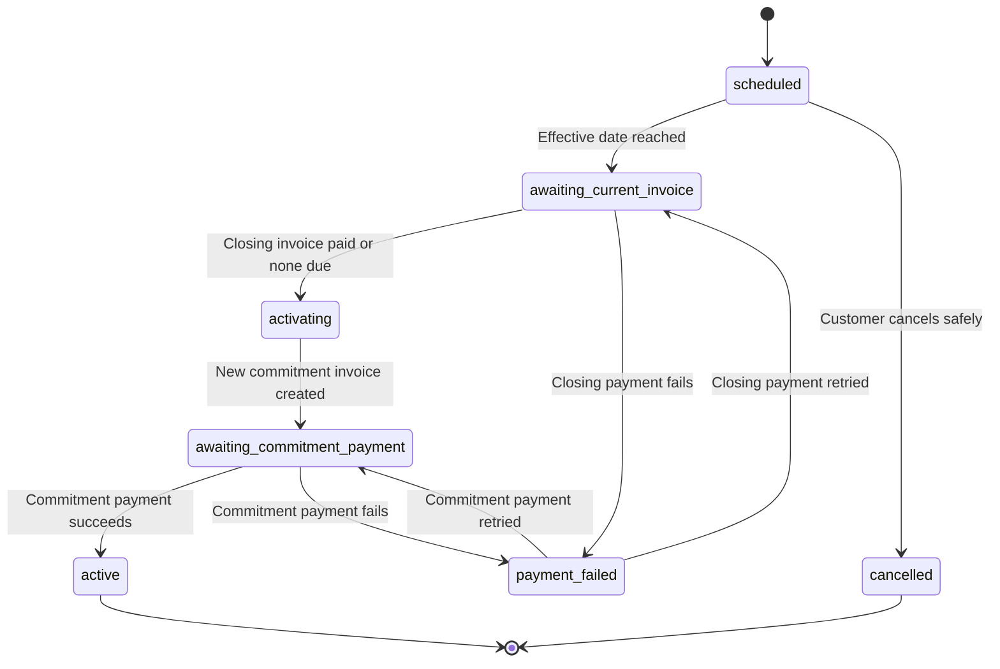

# Open Opportunities API Developer Portal

## Product Specification

| Field | Value |
| --- | --- |
| Product | Open Opportunities API Developer Portal and API monetization platform |
| Status | Working specification |
| Primary audience | Product, engineering, finance, sales, customer success, and operations |
| Portal repository | `spendnetwork/moesif-developer-portal` |
| API repository | `spendnetwork/sn-api` |
| Last reviewed | 3 August 2026 |

This document defines the product as a whole. It covers the customer-facing
developer portal, the SN API changes that support self-service access, and the
Moesif and Stripe configuration that makes usage analytics and billing work.

The following labels are used throughout:

- **Implemented**: represented in the current `prices` portal branch and/or the
  `moesif-dev` SN API branch.
- **Required**: part of the intended production product, whether or not every
  element is complete.
- **Decision required**: a product or commercial policy that must be agreed
  before the related behaviour can be treated as final.
- **Out of scope**: deliberately excluded from the current product.

---

## 1. Executive summary

The Open Opportunities API Developer Portal is the self-service route into the
Open Opportunities API. It lets a customer create an account, choose and pay
for an API plan, receive API credentials, understand their usage and spend,
manage billing, and change plans without booking an onboarding call.

The portal is one part of a larger product system:

- **Auth0** authenticates the human using the portal.
- **The portal frontend** provides the customer experience.
- **The portal backend** coordinates Auth0, Stripe, Moesif, and SN API.
- **Stripe** is the authority for customers, payments, subscriptions, invoices,
  payment methods, and paid credit.
- **SN API and its PostgreSQL database** are the authority for Open
  Opportunities organizations, users, entitlements, roles, and API keys.
- **Moesif** records API usage, associates it with the correct user, company,
  and subscription, evaluates billing meters, and supplies embedded analytics.

The portal must never grant access from a frontend-only state. A successful
payment is not enough on its own. Access is ready only after the payment has
been reconciled, the SN API organization and entitlement have been updated,
the Moesif identities and subscription are aligned, and the API key service is
available.

The core product promise is:

> A customer can go from account creation to a working, billable API request
> without manual intervention, while Open Opportunities retains a reliable
> record of who the customer is, what they may access, what they used, and what
> they have paid.

---

## 2. Product problem

### 2.1 Customer problem

Prospective API customers currently face avoidable friction when access depends
on calls, manual account creation, and manually issued credentials. After they
receive access, they also need a trustworthy way to understand:

- which plan they are on;
- which API capabilities they may use;
- how many billable units they have consumed;
- how much credit remains;
- when and why they will be charged;
- which credentials are active; and
- what to do when a payment, subscription, or credential needs attention.

### 2.2 Business problem

Open Opportunities needs to productize API access without losing control over
commercial terms, permissions, or data access. The business needs:

- self-service customer acquisition;
- commitment-based pricing with different unit rates;
- reliable usage metering across several billable dimensions;
- prepaid credit and overage support;
- custom commercial arrangements for selected customers;
- organization-level billing for teams of users;
- an auditable connection between identity, usage, access, and payment; and
- a route for existing manually created customers to migrate safely.

### 2.3 Why the integrations are necessary

No single system solves the whole problem:

- Auth0 should not decide whether an API call is billable.
- Stripe should not be used as the API key database.
- Moesif should not be the final authority for whether a key is allowed to call
  SN API.
- The portal should not duplicate the API's authorization model.

The product therefore depends on explicit ownership boundaries and reliable
reconciliation between systems.

---

## 3. Goals and non-goals

### 3.1 Goals

1. Allow a new customer to register, pay, and obtain API access without manual
   intervention.
2. Support Basic, Growth, and Enterprise commercial models with plan-specific
   rates and permissions.
3. Attribute every billable API event to one canonical SN API user, one
   canonical SN API organization, and the correct commercial entitlement.
4. Prevent more than one current plan from controlling an organization.
5. Make payment and provisioning operations idempotent and recoverable.
6. Show customers useful, company-level usage, spend, and credit information.
7. Give customers secure API key lifecycle management.
8. Preserve a route for support-assisted and negotiated Enterprise accounts.
9. Keep staging, production, and local development isolated.

### 3.2 Non-goals for the current release

- Replacing Auth0 with a custom login system.
- Replacing SN API with an API gateway.
- Storing recoverable plaintext API keys.
- Letting customers create arbitrary roles or permissions.
- Supporting multiple simultaneous plans for one organization.
- Building a complete organization-member administration console in the first
  release.
- Treating Moesif or Stripe as the master database for Open Opportunities users.
- Automatically migrating every legacy customer without a reviewed migration
  plan.

### 3.3 Capability status snapshot

| Capability | Status | Qualification |
| --- | --- | --- |
| Auth0 registration and login | Implemented | Open Opportunities tenant and portal integration exist |
| Public and authenticated navigation | Implemented | Home redirects authenticated users to Usage |
| Plan catalogue retrieval | Implemented | Customer copy and the active Plans component still need consolidation |
| Basic one-off activation and top-up | Implemented | Zero-balance API enforcement still requires end-to-end verification |
| Growth and Enterprise checkout | Implemented | Requires validated products, commitment prices, and four metered prices |
| Checkout reconciliation | Implemented | Runs from return, webhook, and self-healing page reads |
| SN API portal provisioning | Implemented | Protected by the provisioning token |
| API key create, list, rotate, and revoke | Implemented | Maximum two active keys under the current user-level policy |
| Canonical Moesif user and company attribution | Implemented | Requires identical production mapping and clean legacy overrides |
| Embedded company usage dashboards | Implemented | Workspace IDs, token scopes, and templates are environment configuration |
| Usage and credit summary | Implemented | Data is eventually consistent and uses bounded caching |
| Basic to Growth or Enterprise change | Implemented | Must be proven through complete test billing cycles |
| Other self-service plan changes | Decision required | Unused commitment credit policy is not defined |
| Automatic GBP 500 development credit | Decision required | Legacy code exists but the commercial policy is not approved |
| Multi-user organization administration | Required later | Core database relationships exist; invite and admin experience does not |

---

## 4. Users and stakeholders

### 4.1 API developer

The primary portal user. They want to subscribe, create a key, make requests,
and understand usage. They value quick setup, clear documentation, predictable
billing, and credentials that are easy to rotate.

### 4.2 Organization administrator

The person responsible for the company's Open Opportunities relationship. They
own the plan, payment method, company-level API keys, and billing visibility.
In the initial release, the first portal user effectively acts as the
organization administrator.

### 4.3 Additional organization member

A person who works for the same customer organization. The long-term product
must let several Auth0 users belong to one SN API organization and share the
same commercial entitlement. Member invitation and administration are a later
phase unless explicitly prioritized.

### 4.4 Open Opportunities support and operations

Internal staff need enough identifiers and status information to diagnose a
customer without guessing. They need to see the Auth0 subject, SN API user and
organization IDs, Stripe customer and subscription IDs, Moesif company ID,
plan, billing status, and any open plan change.

### 4.5 Finance and commercial teams

These teams own price approval, credits, negotiated terms, refunds, collections,
tax configuration, and invoice policy. They need Stripe to remain the financial
system of record.

---

## 5. Product principles and key decisions

### 5.1 One organization, one commercial entitlement

All users in an organization consume the same plan and credit balance. The
organization, not an individual login, is the billed customer. There must be:

- one canonical SN API organization;
- one canonical Stripe customer;
- at most one current plan or subscription;
- one Moesif company mapped to the SN API organization ID; and
- one set of company-level usage totals.

### 5.2 SN API is the access authority

The portal may display an entitlement and Moesif may evaluate usage, but SN API
must decide whether each request is authenticated and authorized. This avoids a
cancelled customer retaining access merely because a webhook was delayed.

### 5.3 Payments do not create duplicate identities

Customer lookup must use the stored Stripe customer ID or the immutable Auth0
subject written to Stripe metadata. Email is a recovery signal, not the primary
identity key. If lookup is ambiguous, the system fails closed and requests
support intervention.

### 5.4 Raw API secrets are shown once

SN API stores only a SHA-256 hash and a short identifying prefix. The raw key is
returned only when it is created or rotated. It is never logged or sent to
Moesif.

### 5.5 Reconciliation is expected, not exceptional

Stripe webhooks are the primary asynchronous mechanism. The checkout return,
Billing page, and API Keys page may also run the same idempotent reconciliation
as a self-healing path. These paths must converge on the same end state.

### 5.6 Fail closed on ambiguity

Duplicate Stripe customers, duplicate live subscriptions, mismatched products,
or a missing canonical organization must not be resolved by guessing. The
customer sees a recoverable support message and no additional charge is made.

### 5.7 No API Gateway is required

SN API already authenticates keys, enforces RBAC, and contains Moesif
middleware. An AWS API Gateway could be introduced later for network policy,
centralized throttling, or additional products, but it is not a dependency for
this portal.

---

## 6. Commercial model

### 6.1 Unit rates

All four usage dimensions are priced independently.

| Billable metric | Basic | Growth | Enterprise |
| --- | ---: | ---: | ---: |
| Records or documents returned | GBP 0.13 | GBP 0.10 | GBP 0.07 |
| API calls | GBP 0.26 | GBP 0.20 | GBP 0.14 |
| Aggregate calls | GBP 0.46 | GBP 0.35 | GBP 0.25 |
| Attachments listed or downloaded | GBP 0.65 | GBP 0.50 | GBP 0.35 |

Rates are configuration, not frontend constants. The production Plans and
Usage pages must derive the current prices from the synchronized catalogue.

### 6.2 Basic

**Required product model:** flexible, pure prepaid credit.

- The customer explicitly selects Basic.
- The customer chooses an initial credit purchase in GBP.
- The minimum purchase is GBP 1.00; there is no product-defined maximum.
- Stripe collects a one-off payment, not a recurring subscription charge.
- The paid amount becomes metered-usage credit.
- The customer may add more credit while Basic remains active.
- There is no monthly invoice and no overage.
- Access must stop when available credit reaches zero.
- Basic maps to the `silver` SN API role.

Basic activation and Basic top-up are distinct operations. A top-up cannot
implicitly activate Basic, and a customer on Growth or Enterprise cannot add
Basic credit.

**Implementation note:** current code contains older copy and a legacy
development-credit helper that describe Basic as postpaid or automatically
granted GBP 500. Those paths do not define the approved Basic product and must
be reconciled before production launch.

### 6.3 Growth

**Required product model:** annual prepaid commitment with monthly overage.

- GBP 5,000 is collected at activation and renewal.
- The payment becomes credit applicable to Growth's metered prices.
- Credit is valid for the annual commitment period.
- Usage draws down credit at Growth rates.
- Usage beyond available commitment credit is invoiced monthly in arrears.
- A valid payment method remains on file.
- Growth maps to the `gold` SN API role.

The Stripe product contains one annual commitment price and four monthly
metered prices. Checkout collects the commitment first; reconciliation attaches
all four metered prices to the resulting subscription.

### 6.4 Enterprise

**Required product model:** annual prepaid commitment with monthly overage.

- GBP 12,000 is collected at activation and renewal.
- Usage draws down credit at Enterprise rates.
- Overage is invoiced monthly in arrears.
- Enterprise maps to the `gold` SN API role.
- Additional service, contract, invoice, or data-access terms may be negotiated.

The standard Enterprise product is self-service-capable, but custom Enterprise
pricing should be created as a dedicated Stripe price set or quote. It must
still carry the same canonical metadata so provisioning and metering work.

### 6.5 Development credit

**Decision required.** Leadership previously proposed GBP 500 of development
credit after a customer adds a card. Before enabling this in production, define:

1. whether every new organization is eligible;
2. whether a plan must be selected first;
3. whether the credit expires;
4. whether it can be granted once per organization rather than once per user;
5. which rates apply while it is consumed;
6. whether the customer must have a payment method but no paid plan;
7. what happens at zero balance; and
8. how abuse and repeated sign-ups are prevented.

Until those answers are approved, the automatic grant should remain disabled
and should not appear in customer-facing copy.

### 6.6 Currency

The first complete implementation is GBP. EUR and USD require separate Stripe
prices and explicit rules for plan selection, credit currency, tax, invoice
currency, refunds, and exchange-rate exposure. Currency must never be inferred
from browser locale.

---

## 7. System ownership and architecture

### 7.1 Source-of-truth matrix

| Data or decision | System of record | Notes |
| --- | --- | --- |
| Human identity and login session | Auth0 | Auth0 `sub` is immutable external identity |
| Open Opportunities user | SN API PostgreSQL | Numeric `authuser.id` is canonical Moesif user ID |
| Customer organization | SN API PostgreSQL | Numeric `authorganization.id` is canonical Moesif company ID |
| Payment customer | Stripe | One Stripe customer per SN API organization |
| Payment method, payment, invoice, refund | Stripe | Finance authority |
| Recurring plan lifecycle | Stripe | Growth and Enterprise subscriptions |
| Current API entitlement and role | SN API PostgreSQL | Enforced on every API-key request |
| API key | SN API PostgreSQL | Hash only; raw secret shown once |
| Usage event | Moesif | Received from SN API middleware |
| Billing meter definition | Moesif and Stripe | Names and event semantics must match |
| Customer-facing usage analytics | Moesif plus portal summary | Scoped by canonical company ID |
| Open plan change | SN API PostgreSQL | Durable state machine |

### 7.2 Logical architecture

### 7.3 Identity mapping

| Concept | Identifier |
| --- | --- |
| Portal login | Auth0 `sub`, for example `google-oauth2|...` |
| SN API user | Numeric `authuser.id` |
| SN API company | Numeric `authorganization.id` |
| Moesif user | String form of SN API user ID |
| Moesif company | String form of SN API organization ID |
| Stripe customer | `cus_...`, stored on the SN API organization and user |
| Stripe subscription | `sub_...` for Growth or Enterprise |
| Basic logical subscription | Stable synthetic identifier tied to the Stripe customer |

The Auth0 subject must not appear as the user ID for portal management calls
while API traffic appears under the SN API numeric user. Portal management
traffic is excluded from billable Moesif events; actual API requests use the
canonical numeric IDs.

---

## 8. Navigation and page specifications

Authenticated navigation contains **Usage**, **Plans**, **API Keys**,
**Settings**, and **Billing**. The Open Opportunities logo returns an
authenticated user to Usage and an unauthenticated visitor to Home.

### 8.1 Home (`/`)

**Purpose:** introduce the developer portal and start authentication.

**Audience:** unauthenticated visitors.

**Required content:**

- Open Opportunities brand and API name;
- a concise description of the portal;
- Log in and Create account actions; and
- a small set of truthful product signals, such as countries and sources.

**Behaviour:**

- Authenticated users are redirected to `/dashboard`.
- Authentication errors and expired sessions are explained without exposing
  internal details.
- The page must not duplicate detailed pricing or API documentation.

**Acceptance criteria:** an existing customer does not see sign-up calls to
action after their session has been resolved.

### 8.2 Welcome (`/welcome`)

**Purpose:** orient a first-time user and show the shortest path to value.

**Audience:** authenticated users on their first portal visit.

**Required steps:**

1. Choose a plan.
2. Create an API key.
3. Make a first request using `X-API-Key`.

**Behaviour:** the user can go directly to Plans, API Keys, API documentation,
or Usage. The current implementation records completion in browser local
storage. A later organization-aware implementation should store onboarding
state server-side so it is consistent across devices and team members.

### 8.3 Plans (`/plans`)

**Purpose:** compare plans, identify the current plan, activate access, add
Basic credit, and request supported plan changes.

**Audience:** public visitors may view pricing; authenticated users may buy or
change a plan.

**Required plan card content:**

- plan name;
- commitment model;
- all four unit rates;
- overage behaviour;
- current-plan state;
- one unambiguous primary action; and
- important constraints, such as Basic stopping at zero credit.

**Required actions:**

- Activate Basic with a chosen initial amount.
- Add credit when Basic is already current.
- Start Growth or Enterprise checkout when no plan is active.
- Start a supported plan change when a plan is active.
- Cancel a scheduled change while cancellation is still safe.

**Required states:** loading, catalogue unavailable, no plan, current plan,
checkout pending, scheduled change, payment required, unsupported transition,
and duplicate-subscription conflict.

**Catalogue rule:** product and price IDs come from Moesif/Stripe catalogue
data and stable metadata such as `plan_key`, `usage_metric`, and
`billing_category`. Hardcoded display copy may explain a model, but hardcoded
rates must not override the billing catalogue.

**Current implementation gap:** `PlansView.jsx` contains stale Basic copy and
hardcoded rates, while `MoesifPlans.jsx` and `PlanTile.jsx` reflect the pure
prepaid Basic policy. Only one production Plans implementation should remain.

### 8.4 Checkout (`/checkout`)

**Purpose:** securely collect payment for a new plan or Basic credit.

**Audience:** authenticated users only.

**Basic checkout:**

- requires purchase type `basic_activation` or `basic_credit_top_up`;
- accepts a customer-entered GBP amount with two decimal places;
- enforces the minimum on both frontend and backend;
- uses Stripe Checkout in `payment` mode; and
- includes Auth0 subject, plan, purchase type, and amount in metadata.

**Growth and Enterprise checkout:**

- uses Stripe Checkout in `subscription` mode;
- collects the annual commitment price;
- requires a reusable payment method for later overage; and
- attaches metered prices during idempotent reconciliation.

**Rules:**

- The backend resolves or creates exactly one Stripe customer.
- Refreshing or retrying must not create another charge or subscription.
- A conflict is shown before payment whenever possible.
- No secret Stripe key is exposed to the browser.

### 8.5 Checkout return (`/return`)

**Purpose:** bridge the asynchronous gap between successful Stripe Checkout and
ready API access.

**Required behaviour:**

1. Read the Stripe Checkout session ID from the return URL.
2. Call the authenticated registration/reconciliation endpoint.
3. Show a calm progress state while systems synchronize.
4. Retry transient failures without initiating another payment.
5. Continue to API Keys only when entitlement is confirmed.
6. Distinguish payment failure, provisioning delay, and permanent account
   conflict.

The success screen must never instruct the user to pay again when Stripe has
already recorded a successful payment.

### 8.6 Usage (`/dashboard`)

**Purpose:** let a customer understand activity, accrued cost, and credit at
the organization level.

**Required summary content:**

- current plan and billing model;
- current usage period;
- total billable usage cost;
- four metric rows showing rate, quantity, and accrued amount;
- remaining prepaid credit;
- used versus granted credit where a grant exists;
- pending plan-change status; and
- a clear Add credit action for Basic.

**Required analytics:**

- recent API activity; and
- usage over time.

Moesif embedded workspaces must use dynamic company ID and must be signed by the
portal backend. Dynamic user ID remains disabled so an organization sees its
company-wide usage rather than one individual's requests.

**Data behaviour:** summary values may arrive at different times because
Moesif ingestion, Stripe meter processing, invoice previews, and credit balance
updates are asynchronous. The page should use a short backend cache, retain the
previous value while refreshing, display a last-updated time, and avoid implying
that sub-minute values are final.

**Required empty and error states:** no active plan, no usage yet, embedded
workspace unavailable, expired token, and data temporarily synchronizing.

### 8.7 API Keys (`/keys`)

**Purpose:** create, identify, rotate, and revoke credentials used by customer
applications.

**Required content for each key:**

- customer-provided name;
- optional description;
- non-secret key prefix or key ID;
- status;
- creation date;
- last-used date; and
- rotation guidance.

**Required behaviour:**

- Maximum two active keys per user in the current implementation.
- A key can only be created or rotated when the organization has active access.
- The full key is shown once after creation or rotation.
- At 60 days the page shows a rotation reminder.
- At 90 days the page recommends rotation.
- Rotation revokes the previous key immediately and returns a replacement.
- Revocation is irreversible.
- A cancelled plan prevents use of existing keys at the SN API, even if a
  webhook has not yet revoked them.

**Plan permissions:** unscoped portal keys inherit the user's current role at
request time. Basic uses `silver`; Growth and Enterprise use `gold`. A plan
upgrade therefore updates what an existing unscoped key may do without
reissuing the key. Explicitly scoped keys remain bounded by their stored scopes.

### 8.8 Settings (`/settings`)

**Purpose:** display account identity and provide a route to payment settings.

**Required content:** Auth0 profile name, email, profile image where available,
and a Manage billing action.

**Boundaries:** Auth0 owns login identity changes. Stripe Customer Portal owns
payment method and invoice-detail changes. The page must not pretend to update
fields that are mastered elsewhere.

**Future requirement:** when organization membership is introduced, this page
or a separate Team page should show organization name, admin role, and member
management.

### 8.9 Billing (`/subscription`)

**Purpose:** explain the organization's current commercial state.

**Required content:**

- current plan;
- active, scheduled, past-due, or cancelled state;
- billing model;
- commitment and renewal period where applicable;
- all active usage rates;
- current or scheduled plan change;
- Add credit for Basic; and
- Manage billing for recurring plans.

**Required behaviour:**

- Basic is represented as a logical prepaid entitlement even though it has no
  recurring Stripe subscription.
- Growth and Enterprise are verified from Stripe subscriptions.
- A recently completed checkout triggers self-healing reconciliation before an
  empty state is shown.
- Multiple active subscriptions produce a blocking support state, not an
  arbitrary selection.

### 8.10 Shared session and error experience

All authenticated pages use the same Auth0 session handling. Expired tokens
lead to a clean logout or reauthentication. Errors shown to customers must say
what happened, whether another payment is safe, and what action to take. Internal
IDs and stack traces remain in structured logs, not customer messages.

---

## 9. End-to-end flows

### 9.1 Registration and first plan

### 9.2 Basic activation and top-up

Both webhook and return processing use the same Stripe session or payment
identifier as an idempotency marker. Reprocessing must not duplicate credit.

### 9.3 API key creation

### 9.4 Billable API request

Sensitive headers, including `X-API-Key` and authorization headers, are redacted
before the Moesif event leaves SN API.

### 9.5 Plan change

Only Basic to Growth and Basic to Enterprise are currently approved for
self-service. Other transitions require a defined policy for unused commitment
credit before they become self-service.

The current plan, permissions, and keys remain in effect until every required
payment for the change succeeds. A failed plan change never silently grants the
target plan.

---

## 10. Organization and user model

### 10.1 Initial release

The first Auth0 user creates or claims one SN API organization and becomes its
administrator. Stripe and Moesif relationships belong to that organization.
API keys are created by a user but usage and billing roll up to the organization.

### 10.2 Multi-user target model

The model is realistic for one company with many users because the database
already separates `AuthUser` and `AuthOrganization`. The target flow is:

1. An administrator invites a member by email.
2. Auth0 authenticates the member and supplies a unique `sub`.
3. A verified invitation associates the user with the existing SN API
   organization.
4. The user receives an organization role.
5. Their API keys identify their SN API user ID but use the same organization
   ID, Stripe customer, plan, and credit balance.
6. Moesif can show both individual activity and company-wide billing.

Membership must never be joined by matching email domain alone. Invitations,
verified domain ownership, or administrator approval are required.

### 10.3 Existing customer migration

Existing manually created SN API customers require a controlled linking flow:

- locate the existing user and organization;
- verify ownership;
- add the Auth0 subject rather than creating a duplicate user;
- attach or create one Stripe customer;
- set the Moesif company mapping to the existing organization ID;
- preserve roles and any negotiated access; and
- audit the migration.

---

## 11. API key and permission model

### 11.1 Key format and storage

- Prefix: environment-appropriate `openopps_api_...` style prefix.
- Configured total length: 128 characters in the current target.
- Entropy: generated with a cryptographically secure random source.
- Storage: SHA-256 hash, 32-character identifying prefix, metadata, and status.
- Transport: `X-API-Key` header over HTTPS only.

### 11.2 Authorization

Authentication answers who the key belongs to. RBAC answers what that user may
do. Billing entitlement answers whether the organization currently has access.
All three checks are required.

| Plan | Managed role | Intended capability |
| --- | --- | --- |
| Basic | `silver` | Standard records and endpoints approved for Basic |
| Growth | `gold` | Expanded endpoints including approved aggregations and attachments |
| Enterprise | `gold` | Gold API permissions plus commercial/service terms |

Enterprise-specific data restrictions should be expressed through explicit
roles, scopes, organization filters, or endpoint logic. Moesif can apply quotas
and governance, but it is not a substitute for SN API authorization.

### 11.3 Lifecycle

Create, use, rotate, revoke, expire, and entitlement suspension are distinct
states. Revoked keys are never reactivated by a later subscription. The customer
creates a new key after returning if no active key remains.

---

## 12. Metering and analytics

### 12.1 Billable event contract

Successful billable requests carry enough metadata for Moesif to calculate all
applicable units:

| Field | Meaning |
| --- | --- |
| `environment` | dev, staging, or production |
| `path` | normalized API path |
| `method` | HTTP method |
| `billable_metric` | primary metric classification |
| `api_call_quantity` | normally 1 per billable call |
| `records_returned` | records or documents returned |
| `aggregate_call_quantity` | aggregate operation count |
| `attachment_quantity` | attachment units under the approved definition |
| response status | success or error outcome |
| top-level `subscription_id` | entitlement used for metered billing |

One request may generate more than one charge. For example, a records endpoint
can incur one API-call unit plus several records-returned units. Metric semantics
must be documented and tested at endpoint level to avoid accidental double
charging.

### 12.2 Billing meters

Four independent meters are required in both test and live modes:

- `api_call`
- `records_returned`
- `aggregate_call`
- `attachment`

Each plan has one price per meter. Several Moesif billing meters must not point
to the same Stripe meter unless deliberate combined charging is documented.
Stripe meter event names, Moesif meter filters, and price metadata must match.

### 12.3 Excluded traffic

The following must not be billed:

- health checks;
- OpenAPI and documentation requests;
- portal provisioning endpoints;
- billing webhooks;
- authentication callbacks;
- failed requests unless a commercial rule explicitly says otherwise; and
- infrastructure probes and malicious internet scans.

### 12.4 Reporting delay

The product should state that usage is near-real-time, not instantaneous.
Operational targets should be measured separately for:

- SN API event delivery to Moesif;
- Moesif meter aggregation;
- Stripe meter visibility;
- credit balance updates; and
- portal cache refresh.

---

## 13. Billing and credit rules

### 13.1 Credit ledger

Every credit entry must have an amount, currency, reason, customer,
organization, creation time, optional expiry, and idempotency marker. Paid
credit and promotional credit must remain distinguishable.

### 13.2 Applying credit

Credit applies only to the metered prices intended by the plan. Annual
commitment line items must not consume their own credit. For Growth and
Enterprise, Stripe invoices metered usage and applies available credit before
collecting overage.

### 13.3 Exhaustion

- Basic: access stops at zero; no negative balance and no overage invoice.
- Growth and Enterprise: service continues under the approved collections
  policy and overage is invoiced monthly.

The exact Basic zero-balance enforcement mechanism must be verified end to end.
The requirement is server-side enforcement, not merely hiding the key page.

### 13.4 Refunds and chargebacks

**Decision required.** Define whether unused paid credit is refundable, how
consumed credit is treated after a chargeback, and when access is suspended.
Stripe remains the source of financial events; SN API entitlement changes must
be explicit and audited.

### 13.5 Taxes

Stripe Tax configuration, product tax codes, customer location, VAT evidence,
and invoice wording require finance approval before production. Tax must not be
embedded into usage quantities.

---

## 14. Subscription and plan-change rules

### 14.1 Invariants

1. One Stripe customer per Open Opportunities organization.
2. At most one current commercial entitlement per organization.
3. At most one open plan change per organization.
4. The current plan remains authoritative until a change completes.
5. Payment failure leaves the previous entitlement intact where commercially
   valid.
6. Delayed cancellation events from an old subscription cannot disable a newer
   replacement.
7. Reconciliation is idempotent.

### 14.2 Supported transitions

| Transition | Self-service status | Required behaviour |
| --- | --- | --- |
| No plan to Basic | Supported | One-off payment activates Basic |
| No plan to Growth | Supported | Commitment subscription checkout |
| No plan to Enterprise | Supported | Commitment subscription checkout |
| Basic to Growth | Supported | Create paid subscription; grant only after payment |
| Basic to Enterprise | Supported | Create paid subscription; grant only after payment |
| Growth to Enterprise | Decision required | Define unused Growth credit treatment |
| Enterprise to Growth | Decision required | Define unused Enterprise credit and downgrade timing |
| Growth or Enterprise to Basic | Decision required | Define commitment expiry, unused credit, and final overage |

### 14.3 Billing-period policy

Growth and Enterprise changes should normally take effect at renewal unless the
commercial team approves an immediate change. Basic has no recurring billing
period, so a Basic to commitment-plan upgrade may take effect immediately after
the new commitment succeeds. Unused Basic credit treatment must be explicit:
carry forward, convert, expire, or refund. It must not be described as
"prorated" until an actual calculation and accounting rule exists.

---

## 15. Data model

### 15.1 Core SN API tables

| Table or model | Responsibility |
| --- | --- |
| `authuser` | User identity, Auth0 subject, organization membership, Stripe link |
| `authorganization` | Company, current plan, billing status, Stripe and Moesif links |
| `api_key` | Hashed credentials and lifecycle metadata |
| `billing_subscription` | Subscription or logical entitlement history |
| `billing_plan_change` | Durable plan-change state machine |
| `billing_credit` | Internal record of granted and remaining credit where required |
| RBAC tables | Roles and permissions used by SN API |

### 15.2 Database constraints

- Auth0 subject is unique when present.
- User email remains unique under the current model.
- Stripe subscription ID is unique when present.
- API key hash is unique.
- Only one `billing_subscription.is_current = true` row may exist per
  organization.
- Plan-change request ID is unique.

### 15.3 Auditability

Changes to plan, role, billing status, current subscription, credit, and key
status should be attributable to a user, webhook event, or reconciliation
request. Operational logs must include correlation IDs without including raw
secrets.

---

## 16. Integration requirements

### 16.1 Auth0

- Separate Open Opportunities tenant and branding.
- RS256 ID tokens validated against Auth0 JWKS.
- Exact allowed callback, logout, and web origins per environment.
- Local callback and origin: `http://127.0.0.1:4000`.
- No Auth0 client secret in the frontend.

### 16.2 Stripe

- Separate test and live data.
- Signed webhook verification.
- Required events include checkout completion, invoice success/failure, and
  subscription created/updated/deleted/paused.
- Customer Portal configured for payment methods and invoices.
- Idempotency keys on customer, checkout, credit, and plan-change writes.
- Stable metadata on products, prices, subscriptions, customers, payments, and
  credit grants.

### 16.3 Moesif

- Collector application ID in SN API middleware.
- Management API token only in the portal backend.
- Least-privilege scopes for plans, prices, subscriptions, users, companies,
  billing meters/reports, events, and embedded workspaces as required.
- Stripe company mapping based on canonical SN API organization metadata.
- Test and production applications, workspaces, plans, prices, and meters kept
  separate.

### 16.4 SN API provisioning boundary

Portal-only endpoints are protected by a shared provisioning token over HTTPS.
They create or update portal users, organizations, subscriptions, plan changes,
and keys. They are excluded from Moesif event capture to prevent secret leakage
and internal management traffic from becoming billable usage.

---

## 17. Security and privacy

### 17.1 Mandatory controls

- TLS for every production connection.
- Secrets stored in AWS Systems Manager Parameter Store as SecureString.
- No secrets in Terraform variables committed to source control.
- GitHub Actions deploys through AWS OIDC, not long-lived AWS keys.
- Stripe webhook signatures verified before processing.
- Auth0 tokens validated for issuer, audience, algorithm, and expiry.
- Provisioning token compared in constant time.
- API key, authorization, cookie, and provisioning headers redacted from logs
  and Moesif.
- Database and AWS access follow least privilege.
- Production and staging data are isolated.

### 17.2 Abuse controls

Required production controls include login rate limits, checkout replay
protection, API key creation limits, API rate limits, anomalous usage alerts,
credit-exhaustion enforcement, and manual suspension. Internet scans and 404
probing must not count as customer usage.

### 17.3 Personal data

The minimum cross-system identity data is Auth0 subject, name, email,
organization, and billing identifiers. Retention, deletion, subject-access, and
audit policies require documented owners. Moesif request and response body
capture must be reviewed for procurement data and personal data exposure.

---

## 18. Reliability and recovery

### 18.1 Availability expectations

The portal may be temporarily unavailable without interrupting an already
authorized API request. SN API authentication and enforcement must not depend on
a synchronous portal call.

### 18.2 Retry policy

- Safe reads may be retried with bounded exponential backoff.
- Writes require idempotency keys or durable transition guards.
- Stripe should retry webhook responses outside the 2xx range.
- A customer-facing retry must never create a second payment.

### 18.3 Reconciliation jobs

Production requires scheduled reconciliation for:

- Stripe customers versus SN API organizations;
- live Stripe subscriptions versus current SN API entitlements;
- due plan changes;
- failed or missing Moesif identity synchronization;
- paid Basic sessions missing credit; and
- cancelled plans with active API keys.

### 18.4 Conflict handling

Duplicate customers or subscriptions are quarantined for support. The support
procedure identifies the canonical records, settles or cancels financial
objects, updates SN API, and reruns reconciliation. It must never delete billing
history merely to make a page load.

---

## 19. Observability and support

### 19.1 Structured logs

Each cross-system operation should carry a correlation ID and, where available,
safe identifiers for Auth0 subject hash, SN API user and organization, Stripe
customer and subscription, Moesif company, checkout session, webhook event, and
plan-change request.

### 19.2 Metrics and alerts

At minimum, monitor:

- registration and checkout conversion;
- checkout reconciliation duration and failure rate;
- provisioning success rate;
- webhook age, retries, and failures;
- duplicate-customer and duplicate-subscription conflicts;
- API key creation, rotation, and revocation failures;
- Moesif event delivery failures;
- events without user, company, or subscription ID;
- usage-to-Stripe reporting lag;
- credit below threshold and Basic balance exhausted;
- plan-change state age; and
- SN API 402, 403, 429, and 5xx rates by organization.

### 19.3 Support view

An internal support tool or runbook should answer, from an email or organization
name:

- Who is the canonical user and organization?
- Which plan and role are active?
- Is there an open plan change?
- What does Stripe report?
- What does Moesif report?
- Which keys are active without revealing their secrets?
- What was the last successful reconciliation?
- Is it safe to retry?

---

## 20. Environments and deployment

### 20.1 Environments

| Environment | Purpose | Data policy |
| --- | --- | --- |
| Local | Fast feature development | Auth0 development app, Stripe test mode, development SN API |
| Development | Integrated API and migration testing | Isolated database and non-production billing data |
| Staging | Release-candidate validation | Stripe test mode and staging Moesif application |
| Production | Customer use | Stripe live mode and production Moesif application |

Configuration names may be uniform, but values and resources must be isolated.
Production secrets must never be used for local development.

### 20.2 Hosting

- Frontend: AWS Amplify.
- Portal backend: ECS service behind an Application Load Balancer.
- API: existing SN API deployment.
- Secrets: AWS Systems Manager Parameter Store.
- Container images: environment-specific ECR repositories.
- CI/CD: GitHub Actions using AWS OIDC roles.

### 20.3 Local development

The repository root Docker Compose stack runs the frontend with hot reload on
port 4000 and portal backend on port 3030. Stripe webhook forwarding uses the
official Stripe CLI container and `host.docker.internal`. Local development
must use the current feature branch and test-mode credentials.

---

## 21. Functional acceptance criteria

### 21.1 First purchase

- One Auth0 user produces one SN API user and organization.
- One Stripe customer is created or reused.
- Payment creates one entitlement and no duplicates.
- The user reaches API Keys without manual refresh.
- A created key successfully calls an endpoint permitted by the plan.
- The event appears in Moesif with matching numeric user and company IDs.
- The correct meter quantities reach Stripe.

### 21.2 Basic

- User can choose any valid amount at or above GBP 1.00.
- Initial payment activates Basic exactly once.
- Additional payments increase existing credit without resetting usage.
- A top-up cannot create another plan.
- Growth or Enterprise blocks Basic top-up.
- Access is denied at zero credit.
- No Basic overage invoice is created.

### 21.3 Growth and Enterprise

- Commitment payment is collected before access is upgraded.
- All four metered prices are attached once.
- Paid commitment credit is granted once per billing period.
- Usage first consumes applicable credit.
- Overage appears on the correct monthly invoice.
- Renewal re-grants the approved annual commitment without duplicating it.

### 21.4 Plan changes

- Only one open change exists.
- Current access remains during a pending or failed change.
- Target role becomes effective only after required payment succeeds.
- Existing unscoped keys inherit the new role.
- Duplicate live subscriptions block the flow and trigger an alert.

### 21.5 API keys

- At most two active keys can be created under the current limit.
- Raw key is shown once.
- Database contains no plaintext secret.
- Rotation invalidates the old key immediately.
- Revocation invalidates the key immediately.
- Billing cancellation or exhausted Basic credit prevents request execution.

---

## 22. Product metrics

### 22.1 Acquisition and activation

- Account creation to plan selection conversion.
- Checkout completion rate.
- Median time from sign-up to first successful API call.
- Percentage of customers requiring manual provisioning.

### 22.2 Product health

- Percentage of billable events with user, company, subscription, and metric.
- Usage reconciliation accuracy against sampled invoices.
- Dashboard data freshness.
- API key failure rate after successful checkout.
- Number and age of ambiguous or duplicate accounts.

### 22.3 Commercial outcomes

- Basic top-up frequency and average amount.
- Basic to Growth conversion.
- Commitment utilization.
- Overage revenue.
- Credit breakage, refunds, and failed collections.
- Revenue and usage by organization, plan, and metric.

---

## 23. Known gaps and decisions required

### 23.1 Must resolve before production launch

1. Remove the contradictory Basic postpaid/development-credit copy from the
   active Plans implementation.
2. Decide whether the GBP 500 development credit exists and disable its legacy
   grant path until approved.
3. Verify server-side zero-credit enforcement for Basic.
4. Verify Moesif and Stripe meter definitions in test and live mode.
5. Confirm tax, invoice, refund, and chargeback policy.
6. Confirm exact permissions for `silver` and `gold` roles.
7. Validate all required Stripe webhook events and alarms.
8. Complete end-to-end tests for all supported first purchases and plan changes.
9. Define treatment of unused Basic credit during an upgrade.
10. Define whether and how additional organization users are invited.

### 23.2 Current implementation cleanup

- Consolidate `PlansView` and `MoesifPlans` into one catalogue-driven page.
- Consolidate the usage dashboard implementation and remove superseded
  components only after the replacement is tested.
- Update the inherited Moesif `DATA-MODEL.md`, which still assumes one user per
  Stripe customer and maps Moesif company ID to Stripe customer ID. The Open
  Opportunities implementation uses SN API numeric IDs instead.
- Remove inactive provider plugins and example code only after confirming they
  are not part of deployment or upstream merge strategy.
- Keep product policy in this specification and operational detail in runbooks,
  rather than duplicating contradictory rules in components.

### 23.3 Later-phase decisions

- EUR and USD pricing.
- Customer team management and invitations.
- Enterprise custom-price administration.
- Usage alerts and automatic Basic top-up.
- Customer-set spend caps.
- A support operations console.
- API gateway adoption for additional network or product requirements.

---

## 24. Delivery roadmap

### Phase 1: Product consistency

- Approve this specification.
- Resolve Basic and development-credit policy.
- Make Plans and Billing copy catalogue-driven and internally consistent.
- Verify identity mapping, role definitions, and billing metadata.

### Phase 2: End-to-end hardening

- Complete Basic, Growth, and Enterprise test-mode journeys.
- Test retries, delayed webhooks, duplicate records, and payment failures.
- Verify zero-balance enforcement and overage invoices.
- Add reconciliation schedules, alerts, and support runbooks.

### Phase 3: Production readiness

- Configure live Stripe and Moesif resources.
- Complete tax, legal, privacy, and finance review.
- Run migration rehearsal for existing customers.
- Perform security and load testing.
- Launch with operational ownership and rollback procedures.

### Phase 4: Organization expansion

- Add invitations and organization membership.
- Add organization-admin controls.
- Add customer alerts, spend controls, and richer reporting.
- Add negotiated Enterprise workflows and additional currencies.

---

## 25. Definition of done

The product is ready for general customer use when a new organization can
complete every supported journey without manual data repair, every billable
request is attributable and accurately priced, access is revoked according to
the commercial policy, all financial writes are idempotent, support can diagnose
cross-system state from documented identifiers, and the customer-facing pages
tell one consistent story about plans, credit, usage, and permissions.

This definition includes the portal, SN API, Stripe, Moesif, AWS deployment,
monitoring, and operational procedures. A polished frontend alone is not a
complete developer portal product.
